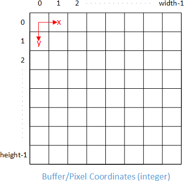

# Setup

## About the Canvas Element

The [canvas](https://developer.mozilla.org/en-US/docs/Web/HTML/Element/canvas) element in HTML is used for creating graphics and animations. It provides two main APIs for drawing:

### 2D API

Also known as the "canvas API" the 2D API is mainly used for simpler 2D graphics. 3D effects can be created but the API is not designed for them and will struggle.

- **Accessibility:** Less complex and very accessible.
- **Performance:** Rendering is handled entirely by the CPU, performance can suffer in complicated scenes.

[More about the 2D API](https://developer.mozilla.org/en-US/docs/Web/API/Canvas_API)

### WebGL API

The WebGL API is used for complicated 3D graphics and more demanding effects like particle systems, complex lighting, etc.

- **Complexity:** Requires a deeper understanding of computer graphics concepts.
- **Performance:** Rendering is hardware-accelerated using the system's GPU. Performs a lot better with complicated graphics if the hardware is there.

[More about the WebGL API](https://developer.mozilla.org/en-US/docs/Web/API/WebGL_API)

**Note:** We're only looking at the 2D Canvas API here.

## Accessing the 2D Canvas API

To use the 2D Canvas API you access the context of the canvas element with this method:

```js
.getContext("2d");
```

The result can be assigned to a variable which then exposes all the 2D API methods.

## Coordinate System

Like Many 2D graphics systems the coordinate system of the Canvas API has its origin `(0,0)` in the top-left corner of the canvas. The y-axis increases downwards.


